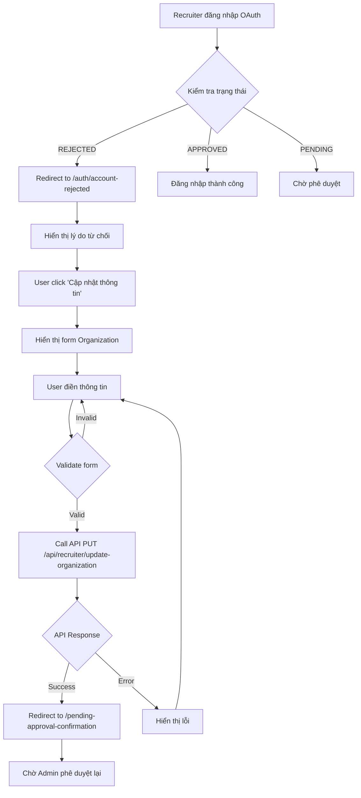

# Chức năng Gửi lại Thông tin Doanh nghiệp cho Recruiter bị Từ chối

## Tổng quan

Tài liệu này mô tả chức năng cho phép recruiter bị từ chối (rejected) có thể cập nhật và gửi lại thông tin doanh nghiệp để được xét duyệt lại.

## Luồng hoạt động (Flow)



## Các thành phần chính

### 1. API Endpoint

**Endpoint**: `PUT /api/recruiter/update-organization`

**Request Body**:
```typescript
{
  companyName: string;      // Bắt buộc
  website?: string;         // Tùy chọn
  logoUrl?: string;         // Tùy chọn
  businessLicense: string;  // Bắt buộc
  contactPerson: string;    // Bắt buộc
  phoneNumber: string;      // Bắt buộc
  companyAddress: string;   // Bắt buộc
  about?: string;           // Tùy chọn
}
```

**Implementation**:
- File: `/src/lib/recruiter-api.ts`
- Function: `updateOrganization()`

### 2. Trang Account Rejected

**Route**: `/auth/account-rejected`

**File**: `/src/app/auth/account-rejected/page.tsx`

**Tính năng**:
- Hiển thị thông báo từ chối
- Hiển thị lý do từ chối (nếu có)
- Nút "Cập nhật thông tin doanh nghiệp"
- Form cập nhật thông tin (toggle)
- Link liên hệ support

**Query Parameters**:
- `reason`: Lý do từ chối từ backend

### 3. Component Form

**Component**: `OrganizationUpdateForm`

**File**: `/src/components/auth/OrganizationUpdateForm.tsx`

**Props**:
```typescript
interface OrganizationUpdateFormProps {
  onSuccess?: () => void;
  onCancel?: () => void;
  initialData?: Partial<UpdateOrganizationRequest>;
  submitButtonText?: string;
  showCancelButton?: boolean;
}
```

**Tính năng**:
- Form validation
- Loading state
- Error handling
- Toast notifications
- Logo preview
- Responsive design

### 4. Trang Xác nhận Pending

**Route**: `/pending-approval-confirmation`

**File**: `/src/app/pending-approval-confirmation/page.tsx`

**Tính năng**:
- Thông báo gửi thành công
- Hướng dẫn các bước tiếp theo
- Thông tin liên hệ support
- Auto-redirect sau 8 giây

### 5. OAuth Callback Handler

**Route**: `/auth/oauth/callback`

**File**: `/src/app/auth/oauth/callback/route.ts`

**Cập nhật**:
- Xử lý response với status REJECTED
- Redirect đến `/auth/account-rejected` với reason

```typescript
else if (data.code === 403 || 
         (data.result && data.result.verificationStatus === 'REJECTED')) {
  const reason = data.result?.rejectReason || data.message || "";
  return NextResponse.redirect(
    new URL(`/auth/account-rejected?reason=${encodeURIComponent(reason)}`, request.url)
  );
}
```

## Validation Rules

### Required Fields
1. **companyName**: Không được để trống
2. **businessLicense**: Không được để trống
3. **contactPerson**: Không được để trống
4. **phoneNumber**: 
   - Không được để trống
   - Phải là 10-11 số
   - Pattern: `[0-9]{10,11}`
5. **companyAddress**: Không được để trống

### Optional Fields
- **website**: Phải là URL hợp lệ (nếu có)
- **logoUrl**: Phải là URL hợp lệ (nếu có)
- **about**: Không giới hạn

## UI/UX Features

### Trang Account Rejected

**Initial View**:
- ❌ Icon từ chối (màu đỏ)
- Tiêu đề rõ ràng
- Lý do từ chối (highlight màu đỏ)
- Info box hướng dẫn (màu xanh)
- 2 buttons: "Cập nhật thông tin" & "Liên hệ hỗ trợ"

**Form View**:
- Nút "Quay lại"
- Tiêu đề & mô tả
- Form đầy đủ các trường
- Preview logo (nếu có URL)
- 2 buttons: "Gửi lại yêu cầu" & "Hủy"
- Loading state khi submit

### Responsive Design
- Mobile-first approach
- Grid layout cho desktop (2 columns)
- Stack layout cho mobile (1 column)
- Buttons full-width trên mobile

### Accessibility
- ARIA labels
- Keyboard navigation
- Focus states
- Error messages
- Loading indicators

## Error Handling

### Client-side Validation
```typescript
if (!formData.companyName || !formData.businessLicense || 
    !formData.contactPerson || !formData.phoneNumber || 
    !formData.companyAddress) {
  toast.error("Vui lòng điền đầy đủ các trường bắt buộc");
  return;
}
```

### API Error Handling
```typescript
try {
  await updateOrganization(formData);
  toast.success("Cập nhật thành công!");
} catch (error: any) {
  toast.error(error.message || "Có lỗi xảy ra");
}
```

## Testing Scenarios

### 1. Happy Path
1. Recruiter bị từ chối đăng nhập
2. Được redirect đến `/auth/account-rejected`
3. Xem lý do từ chối
4. Click "Cập nhật thông tin"
5. Điền form đầy đủ
6. Submit thành công
7. Redirect đến `/pending-approval-confirmation`
8. Chờ admin phê duyệt

### 2. Validation Error
1. User điền form thiếu trường bắt buộc
2. Hiển thị toast error
3. Focus vào trường lỗi
4. User sửa và submit lại

### 3. API Error
1. User submit form
2. API trả về lỗi (network, server, etc.)
3. Hiển thị toast error
4. User có thể thử lại

### 4. Cancel Flow
1. User mở form
2. Click "Hủy"
3. Quay lại view ban đầu
4. Form data được reset

## Backend Integration

### Expected Backend Behavior

1. **Endpoint**: `PUT /api/recruiter/update-organization`
2. **Authentication**: Requires JWT token (recruiter role)
3. **Request**: JSON body với các trường như trên
4. **Response Success (200)**:
```json
{
  "code": 200,
  "message": "Organization updated successfully",
  "result": {
    "recruiterId": 123,
    "verificationStatus": "PENDING"
  }
}
```

5. **Response Error (4xx/5xx)**:
```json
{
  "code": 400,
  "message": "Invalid business license format",
  "errors": [...]
}
```

### Status Flow
```
REJECTED → (update-organization) → PENDING → (admin approve) → APPROVED
```

## Security Considerations

1. **Authentication**: API yêu cầu JWT token hợp lệ
2. **Authorization**: Chỉ recruiter owner có thể update
3. **Input Validation**: Sanitize và validate mọi input
4. **Rate Limiting**: Giới hạn số lần submit (tránh spam)
5. **CSRF Protection**: Token protection cho form submission

## Future Enhancements

### Phase 2 (Nice to have)
1. **File Upload**: Upload business license files
2. **Draft Save**: Lưu form draft
3. **History**: Xem lịch sử submission
4. **Real-time Status**: WebSocket notification
5. **Email Notification**: Thông báo qua email
6. **Multi-language**: i18n support

### Phase 3 (Advanced)
1. **Auto-fill**: Điền thông tin từ database
2. **AI Validation**: AI check business license
3. **Video KYC**: Video verification
4. **Analytics**: Track rejection reasons
5. **A/B Testing**: Optimize conversion rate

## Deployment Checklist

- [ ] Test tất cả flows trên local
- [ ] Test API integration với backend
- [ ] Test responsive trên mobile/tablet
- [ ] Test error scenarios
- [ ] Review code với team
- [ ] Update API documentation
- [ ] Deploy to staging
- [ ] QA testing
- [ ] Deploy to production
- [ ] Monitor errors
- [ ] User feedback collection

## Support & Maintenance

### Monitoring
- API success/failure rate
- Form submission rate
- Conversion rate (reject → resubmit → approve)
- Error logs
- User feedback

### Common Issues
1. **"API 401 Unauthorized"**: Token expired, cần login lại
2. **"Form không submit được"**: Check validation errors
3. **"Không redirect"**: Check routing configuration
4. **"Toast không hiển thị"**: Check react-hot-toast setup

## Contact

- **Developer**: GitHub Copilot
- **Documentation**: This file
- **Support Email**: support@careermate.example

---

**Version**: 1.0.0  
**Last Updated**: November 1, 2025  
**Status**: ✅ Implemented and Ready for Testing
