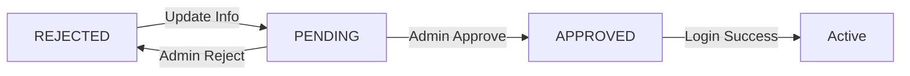

# 🔄 Rejected Recruiter Resubmission - Quick Start Guide

## 📋 Tổng quan

Chức năng cho phép recruiter bị từ chối có thể cập nhật và gửi lại thông tin doanh nghiệp để xét duyệt lại.

---

## 🚀 Quick Start

### 1️⃣ Kịch bản sử dụng

**Khi nào được sử dụng?**
- Recruiter đăng ký/đăng nhập và bị từ chối (status: REJECTED)
- Sau khi bị từ chối, recruiter muốn cập nhật thông tin để được xét duyệt lại

**Flow cơ bản:**
```
Login (OAuth) 
  → REJECTED Status 
  → Redirect to /auth/account-rejected 
  → Click "Cập nhật thông tin" 
  → Fill form 
  → Submit 
  → Pending approval
```

---

## 📁 Files Changed/Created

### New Files
1. ✅ `/src/components/auth/OrganizationUpdateForm.tsx` - Form component
2. ✅ `/REJECTED_RECRUITER_RESUBMISSION.md` - Full documentation
3. ✅ `/TEST_SCENARIOS_REJECTED_RESUBMISSION.md` - Test cases

### Modified Files
1. ✅ `/src/lib/recruiter-api.ts` - Added `updateOrganization()` API
2. ✅ `/src/app/auth/account-rejected/page.tsx` - Complete redesign
3. ✅ `/src/app/auth/oauth/callback/route.ts` - Handle REJECTED status
4. ✅ `/src/app/pending-approval-confirmation/page.tsx` - New content

---

## 🔌 API Integration

### Endpoint
```
PUT /api/recruiter/update-organization
```

### Request Body
```typescript
{
  companyName: string;      // Required ✅
  website?: string;         // Optional
  logoUrl?: string;         // Optional
  businessLicense: string;  // Required ✅
  contactPerson: string;    // Required ✅
  phoneNumber: string;      // Required ✅ (10-11 digits)
  companyAddress: string;   // Required ✅
  about?: string;           // Optional
}
```

### Response
```json
{
  "code": 200,
  "message": "Organization updated successfully",
  "result": {
    "recruiterId": 123,
    "verificationStatus": "PENDING"
  }
}
```

---

## 🎨 UI Components

### 1. Account Rejected Page (`/auth/account-rejected`)

**Initial View:**
- ❌ Rejection icon & message
- 📝 Rejection reason (from backend)
- 💡 Helpful info box
- 🔘 2 buttons: "Cập nhật thông tin" & "Liên hệ hỗ trợ"

**Form View:**
- ⬅️ Back button
- 📝 Full organization form
- 🖼️ Logo preview (if URL provided)
- 💾 Submit & Cancel buttons

### 2. Pending Confirmation Page (`/pending-approval-confirmation`)

- ✅ Success icon & message
- 📋 Next steps info
- 🔗 Support contact
- 🏠 Navigation buttons
- ⏱️ Auto-redirect after 8s

---

## 🧪 Testing

### Quick Test (Manual)

**Test Account:**
```
Email: rejected.recruiter@test.com
Status: REJECTED
```

**Steps:**
1. Login với OAuth
2. Verify redirect to `/auth/account-rejected`
3. Click "Cập nhật thông tin doanh nghiệp"
4. Fill form:
   ```
   Company Name: FPT Software
   Business License: BL-2025-FPT-12345
   Contact Person: Nguyễn Văn A
   Phone: 0929098765
   Address: Ftown1, Đà Nẵng
   ```
5. Submit
6. Verify redirect to confirmation page

**Expected:** ✅ No errors, smooth flow

### Run Tests
```bash
# Kiểm tra lỗi compile
npm run build

# Chạy dev server
npm run dev
```

---

## 🐛 Common Issues & Solutions

### Issue 1: "API 401 Unauthorized"
**Cause:** Token expired or invalid  
**Solution:** Login lại để refresh token

### Issue 2: Form không submit
**Cause:** Validation errors  
**Solution:** Check all required fields (*)

### Issue 3: Không redirect sau submit
**Cause:** API error or network issue  
**Solution:** Check console & network tab

### Issue 4: Toast không hiển thị
**Cause:** react-hot-toast not configured  
**Solution:** Verify Toaster component in layout

---

## 📸 Screenshots

### Rejection Notice
```
┌─────────────────────────────────────┐
│           ❌                        │
│  Đơn đăng ký đã bị từ chối         │
│                                     │
│  [Lý do: ...]                      │
│                                     │
│  [💡 Bạn có thể làm gì?]          │
│                                     │
│  [Cập nhật thông tin] [Liên hệ]    │
└─────────────────────────────────────┘
```

### Organization Form
```
┌─────────────────────────────────────┐
│  ← Quay lại                         │
│                                     │
│  Cập nhật thông tin doanh nghiệp   │
│  ─────────────────────────────────  │
│                                     │
│  Tên công ty *     [________]      │
│  Website           [________]      │
│  Logo URL          [________]      │
│  Giấy phép KD *    [________]      │
│  Người liên hệ *   [________]      │
│  SĐT *             [________]      │
│  Địa chỉ *         [________]      │
│  Giới thiệu        [________]      │
│                                     │
│  [Gửi lại] [Hủy]                   │
└─────────────────────────────────────┘
```

---

## 🔐 Security Notes

✅ **Implemented:**
- Input validation (client & server)
- Authentication required (JWT)
- XSS protection (HTML sanitization)
- CSRF protection

⚠️ **TODO:**
- Rate limiting (prevent spam)
- File upload validation
- Business license verification

---

## 📚 Documentation Links

- **Full Documentation**: [REJECTED_RECRUITER_RESUBMISSION.md](./REJECTED_RECRUITER_RESUBMISSION.md)
- **Test Scenarios**: [TEST_SCENARIOS_REJECTED_RESUBMISSION.md](./TEST_SCENARIOS_REJECTED_RESUBMISSION.md)
- **API Docs**: (Link to backend API docs)

---

## 🎯 Key Features

- ✅ Clean & intuitive UI
- ✅ Form validation (client-side)
- ✅ Real-time feedback (toast notifications)
- ✅ Responsive design (mobile/tablet/desktop)
- ✅ Logo preview
- ✅ Error handling
- ✅ Loading states
- ✅ Auto-redirect after success
- ✅ Accessible (keyboard navigation, ARIA)

---

## 📊 Status Flow



---

## 🤝 Contributing

### Before Committing
- [ ] Test locally
- [ ] Check for console errors
- [ ] Verify responsive design
- [ ] Test error scenarios
- [ ] Update documentation if needed

### Code Style
- Use TypeScript strict mode
- Follow existing code patterns
- Add comments for complex logic
- Use meaningful variable names

---

## 📞 Support

- **Email**: support@careermate.example
- **Slack**: #recruiter-portal (if applicable)
- **Documentation**: This file + linked docs

---

## ✅ Checklist

### For Developers
- [x] API function implemented
- [x] Form component created
- [x] Pages updated
- [x] Validation added
- [x] Error handling added
- [x] Toast notifications
- [x] Responsive design
- [x] Documentation written

### For QA
- [ ] All P0 tests passed
- [ ] All P1 tests passed
- [ ] Security tested
- [ ] Performance acceptable
- [ ] Accessibility checked

### For DevOps
- [ ] Environment variables set
- [ ] API endpoint configured
- [ ] CORS configured
- [ ] Monitoring enabled

---

**Version**: 1.0.0  
**Last Updated**: November 1, 2025  
**Status**: ✅ Ready for Testing  
**Developer**: GitHub Copilot
